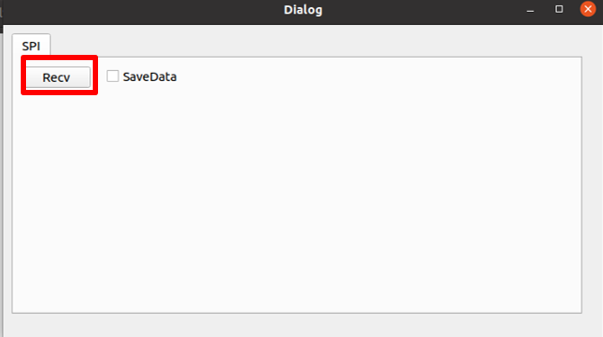

# Edge Impulse object detection with centroids (FOMO) project build from C++ library example
Edge Impulse object detection with centroids project (FOMO) can be deployed as a C++ library. This example shows how to export the model from your Edge Impulse project, build it with the HIMAX WE1 SDK and deploy it to HIMAX WE1 EVB. 

## Prerequisites
- Development Toolkit
  - This example only supports GNU Development Toolkit. Please check the GNU Development Toolkit chapter [here](https://github.com/HimaxWiseEyePlus/himax_tflm#prerequisites) to prepare the environment to build the example.
- Download related third party data (only need to download once)
    ```bash
    make download
    ```

## Edge Impulse object detection project setup.
Please check [here](https://docs.edgeimpulse.com/docs) and [here](https://docs.edgeimpulse.com/docs/himax-we-i-plus#all-licenses-are-in-use-by-other-developers) for Himax WE-I Plus to build your own Edge Impulse project. The Edge impulse detect objects with centroids FOMO document can be reference [here](https://docs.edgeimpulse.com/docs/tutorials/detect-objects-using-fomo). In this example, we use a Mouse Detection project to demonstrate. The following shows the outline of the Impulse design in this project.
- Input Image data with your own label
  - Image width = 160
  - Image height = 160
  - Image channel = 1
    
- Output features
  - 1 (mouse)
- At `Create impulse` page, you can set your own input and output setting.
  
## Export C++ library to repository
- Head over to your Edge Impulse project, go to `Deployment` page, select `C++ library `. 

  

- Be careful about the Ram usage. It should not be bigger than the HIMAX WE1 SRAM constraint.

  

- Then, select `Quantized (int8)` and click `Build` to download the `.zip` file of your project.

  

- Extract the `.zip` file and copy the `model-parameters` , `edge-impulse-sdk` and `tflite-model` folders to this example folder, then your folder structure should look like this:
    ```
    WE_I_Plus_User_Examples/Edge_Impulse_Object_detection_Example/
    |_edge-impulse-sdk
    |_himax_we1_sdk
    |_image_gen_linux
    |_images
    |_main.cc
    |_Makefile
    |_memory.x
    |_memory.lcf
    |_model-parameters
    |_README.md
    |_tflite-model
    |_third_party
    ```
- Your folder structure of `WE_I_Plus_User_Examples/Edge_Impulse_Object_detection_Example/` should be looks like 

  


## Build example and flash image
- Build Edge Impulse example and flash image. Flash image name will be `edgeimpulse_example.img`. 
    ```
    make all
    make flash
    ```
- Flash Image Update at Linux Environment you can reference [here](https://github.com/HimaxWiseEyePlus/bsp_tflu/tree/master/HIMAX_WE1_EVB_user_guide#flash-image-update-at-linux-environment).
- After above steps, update `edgeimpulse_example.img` to HIMAX WE1 EVB.
  - In our example, we display the detect object postition on the console(minicom).

    
  - You can see your detect results with a 50*50 pixel box on the PC TOOL. Because this Edge Impulse FOMO model can detect object with only centroids [here](https://docs.edgeimpulse.com/docs/tutorials/detect-objects-using-fomo) for more detail.

    - Before you click `PC_TOOL_Linux`, you can download [here](https://github.com/HimaxWiseEyePlus/WE_I_Plus_User_Examples/releases/download/v1.0/PC_TOOL_Linux), please key-in following command on console.
      ```  
      chmod 777 PC_TOOL_Linux
      ```
    - Install FT4222 linux driver

      - You can reference the user guide [here](https://github.com/HimaxWiseEyePlus/bsp_tflu/tree/master/HIMAX_WE1_EVB_user_guide#update-bootloader-version-at-linux-environment) to download and install FT4222 linux driver.
    - Click `PC_TOOL_Linux` under your folder.
      
    - Please click `Recv` button
      
    - Then you will see your detect results with a 50*50 pixel box.
      