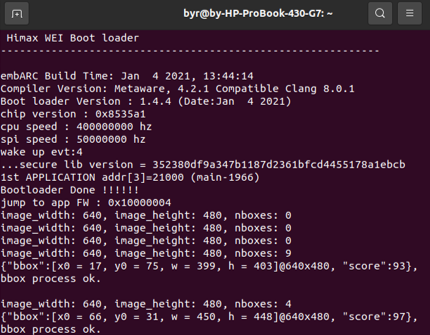
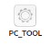
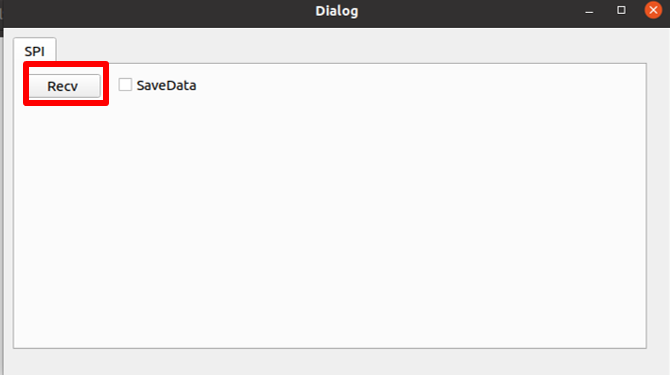
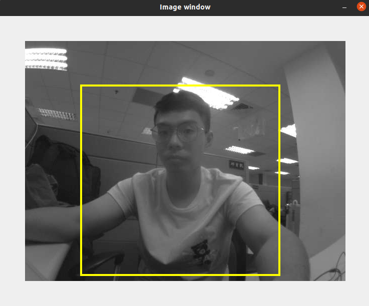

# HIMAX Yolo-Fastest Person Detection Example
This example shows how to deploy your own yolo-fastest tflite model to HIMAX WE-I EVB.

- Prerequisites
  - This example will supports GNU and Metaware Development Toolkit. Please check the Development Toolkit chapter [here](https://github.com/HimaxWiseEyePlus/himax_tflm#prerequisites) to prepare the environment to build the example.
- Build the example and flash image.
  - Download related third party and library data (only need to download once)

    ```
    make download
    ```

  - Default building toolchain in makefile is GNU toolkit, if you are trying to build example with Metaware Development toolkit. please change the `ARC_TOOLCHAIN` define in `Makefile` like this

    ```
    ARC_TOOLCHAIN ?= mwdt
    #ARC_TOOLCHAIN ?= gnu
    ```
  
  - Train your own yolo-fastest model
    - Model default used by this example is training with COCO dataset, please take a look [here](https://github.com/HimaxWiseEyePlus/Yolo-Fastest) about training detail.
    - The other pre-trained model, `yolo-fastest-1_1_160_person_himax.tflite`, is trained by our own HIMAX dataset, please take a look [here](https://github.com/HimaxWiseEyePlus/Yolo-Fastest#himax-pretrained-model) for more detail.

  - Please put your own model which is trained by COCO dataset and rename it to `yolo.tflite`, and you can also download from [here](https://github.com/HimaxWiseEyePlus/Yolo-Fastest/raw/master/ModelZoo/yolo-fastest-1.1_160_person/yolo-fastest-1.1_160_person.tflite). The other pre-trained model, `yolo-fastest-1_1_160_person_himax.tflite`, which is trained by our own HIMAX dataset, and you can also download from [here](https://github.com/HimaxWiseEyePlus/Yolo-Fastest/raw/master/ModelZoo/yolo-fastest-1.1_160_person/yolo-fastest-1_1_160_person_himax.tflite). Your folder structure should look like this:
    ```
    WE_I_Plus_User_Examples/HIMAX_Yolo_Fastest_Person_Detection_Example/
    |_ yolo-fastest-1_1_160_person_himax.tflite
    |_ himax_we1_sdk
    |_ image_gen_linux
    |_ images
    |_ LICENSE
    |_ Makefile
    |_ memory.lcf
    |_ memory.x
    |_ README.md
    |_ tensorflow
    |_ third_party
    |_ yolo.tflite
    |_ yolo_fastest
    ```
  - Example with reading model from flash of HIMAX SDK, detail device initialization will be done by `hx_drv_flash_init()` and `hx_drv_flash_get_Model_address()` .
    - You should initial flash first. Then you can get the right model address.  
    - You can simply call them to initial flash and get model addess to retrieve the model data from flash.
  - Build the example with
      - Model trained by COCO dataset:

        We default use the model , `yolo.tflite` , trained by COCO dataset, just key-in following command on the console. Flash image name will be `yolo*.img`.
        ```bash
        make yolo
        make flash example=yolo
        ```
      - Model trained by HIMAX dataset: 
        
        If you want to build the example with `yolo-fastest-1_1_160_person_himax.tflite`.
          - Change the define in `yolo_fastest/main_fuction.cc` line 14 
            ```
            //#define COCO_DATASET 1
            ```
            to make it run the below anchor parameters, which is analyzed the distribution of anchors by our own HIMAX dataset.
            ```c++
            float anchor1[] = {19, 72, 34, 103, 73, 109};
            float anchor2[] = {6, 25, 12, 43, 34, 33};
            ```
          - Change the define in Makefile
            ```
            #YOLO_DATASET ?= coco
            YOLO_DATASET ?= himax
            ```
          - Just key-in following command on the console. Flash image name will be `yolo*.img`.
            ```bash
            make yolo
            make flash example=yolo
            ```
  - Then, you should update the application, `yolo*.img` , in the flash.
    - Flash Image Update at Linux Environment [here](https://github.com/HimaxWiseEyePlus/bsp_tflu/tree/master/HIMAX_WE1_EVB_user_guide#flash-image-update-at-linux-environment)
- After above steps, update `yolo*.img` to HIMAX WE1 EVB. After get data from sensor, we can display them on the console and see the images with bounding box on the PC TOOL.
  - You can see your detect results on the console .
    - Console (minicom)

      


  - You can see your detect results with bounding box on the PC TOOL.
    - Before you click `PC_TOOL`, you can download [here](https://github.com/HimaxWiseEyePlus/WE_I_Plus_User_Examples/releases/download/v1.0/PC_TOOL), please key-in following command on console.
      ```bash
      chmod 777 PC_TOOL
      ```

    - Click `PC_TOOL` under your folder.

       
    - Please click `Recv` button.
      

    - Then you will see your detect results with bounding box.
     


