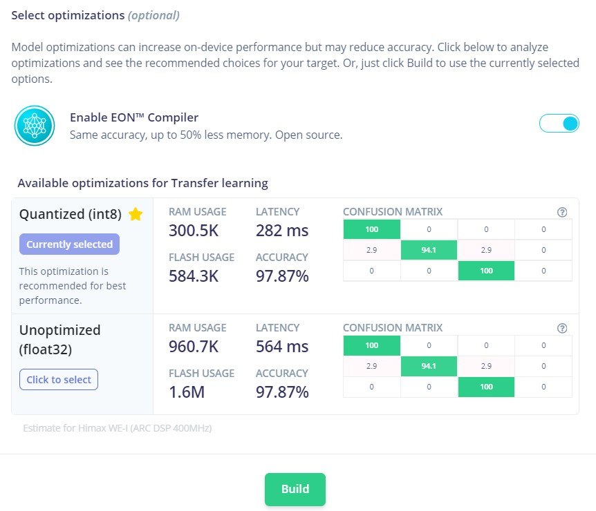
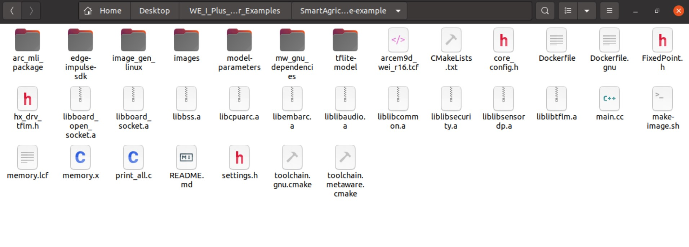
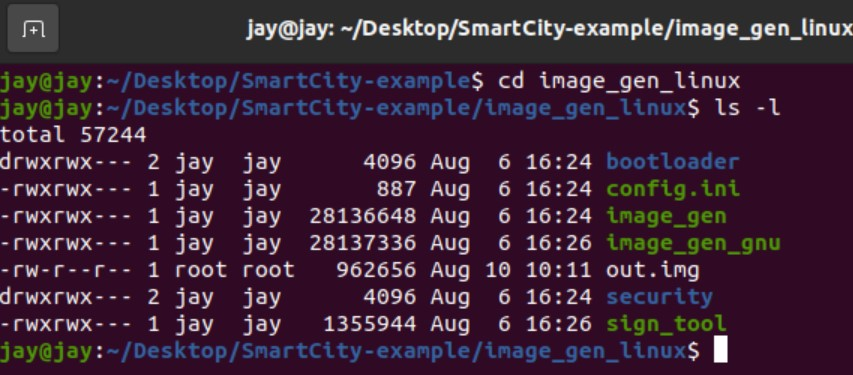
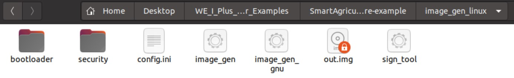

# Smart Agriculture Application using Himax WE-I Plus
The Smart Agriculture Application includes use of the Himax WE-I Plus Board with SparkFun's Qwiic sensors on farms or plantations for ML based crop detection and to simultaneously obtain PHT, CO2, VOC data required in order to monitor proper growth of plants.<br>

The Machine Learning crop detection model is developed on [Edge Impulse](https://docs.edgeimpulse.com/docs/himax-we-i-plus).

## Prerequisites
  - [Himax WE-I Plus EVB Endpoint AI Development Board](https://www.sparkfun.com/products/17256)
  - [LoRa - REYAX RYLR896](https://reyax.com/products/rylr896/) [[ AT COMMAND GUIDE ]](https://reyax.com/wp-content/uploads/2020/01/Lora-AT-Command-RYLR40x_RYLR89x_EN.pdf)
  - Either of the sensor boards 
    - [SparkFun Environmental Combo Breakout - CCS811/BME280 (Qwiic)](https://www.sparkfun.com/products/14348)
    - [SparkFun (SparkX) Qwiic Pressure/Humidity/Temp (PHT) Sensor - MS8607](https://www.sparkfun.com/products/16298)\
    The suitable board can be set from the `settings.h` file.
    

[Docker](https://docs.docker.com/engine/install/ubuntu/) is required for self buid ML models. 
## Connections 

The J3 Connector\

- From LoRa to Himax WE-I Plus
  | LoRa        |                    |          |
  | :---------- | :----------------: | :------: |
  | Orange      |        3.3V        | J3 Pin 1 |
  | Black       |        GND         | J3 Pin 7 |
  | Green       | WEI TXD \ LoRa RXD | J3 Pin 2 |
  | Red         | WEI RXD \ LoRa TXD | J3 Pin 3 |
- From Sparkfun Sensor boards to Himax WE-I Plus
  | QWIIC       |       |          |
  | :---------- | :---: | :------: |
  | Red         | 3.3V  | J3 Pin 1 |
  | Black       |  GND  | J3 Pin 7 |
  | Yellow      |  SCL  | J3 Pin 5 |
  | Blue        |  SDA  | J3 Pin 6 |

## Build ML Model
`Note`: To deploy `Already Compiled Application` (for CCS811/BME280 sensor board) skip to [Flash Image](#flash-image) section.<br>

To train the Himax WE-I Plus board for crop detection an
[Edge Impulse ML model](https://docs.edgeimpulse.com/docs) is made.

 Impulse design outline:
- Input Image data
  - Image width = 96
  - Image height = 96
  - Resize mode = Squash
- Output features
  - 3 (Maize, Sugarcane, Wheat)

Deploy the model in form of Quantized(int8) `C++ Library` using EON™ Compiler.

Copy the contained folders to this application folder. Note that you `do not` copy CMakeLists.txt

Then your folder structure of this directory should be

```
  WE_I_Plus_User_Examples/SmartAgriculture-example/
  |_arc_mli_package
  |_edge-impulse-sdk
  |_image_gen_linux
  |_images
  |_model-parameters
  |_mw_gnu_dependencies
  |_tflite-model
  |_main.cc
  |_settings.h
  |_README.md
  |...
```
## Docker Compile/Rebuilt
Next step is to compile/rebuilt the application using `Docker`. The following set of commands needs to be executed:
```
sudo docker build -t himax-build-gnu -f Dockerfile.gnu .
```
```
mkdir -p build-gnu
sudo docker run --rm -it -v $PWD:/app himax-build-gnu /bin/bash -c "cd build-gnu && cmake -DCMAKE_TOOLCHAIN_FILE=toolchain.gnu.cmake .."
```
```
sudo docker run --rm -it -v $PWD:/app:delegated himax-build-gnu /bin/bash -c "cd build-gnu && make -j && sh ../make-image.sh GNU"
```
If you face 'Permission denied' error, follow these steps: <br>
  Step1: Use `cd image_gen_linux` to change the directory. <br>
  Step2: Type `ls -l` command to see status of files.
  
  Note that `image_gen_gnu`, `image_gen` and `sign_tool` files need chmod +x permissions.  <br>
  Step3: If any of these files don't have the required permission assign them by 
  ```
  chmod u+x image_gen_gnu
  ```
  ```
  chmod u+x image_gen
  ```
  ```
  chmod u+x sign_tool
  ```
  Step4: Come back one directory by `cd ..` command and then run the previous Docker commands.

## Flash Image
Flash image name will be `out.img` and will be located in `image_gen_linux` folder of this directory.

Use Himax Flash Tool to flash this Image.

   ```
    himax-flash-tool --(firmware-path)/image_gen_linux/out.img
  ```

## Output
  - The environment data format
    - Co2 Value|Temperature|Humidity|Pressure\
      LoRa REYAX RYLR896\
      L.H.S - Sender (Himax WE-I Plus Board) ADDRESS=1, CRFOP=7\
      R.H.S - LoRa Receiver ADDRESS=2, CRFOP=7


https://user-images.githubusercontent.com/87312836/129950296-dec87ed6-90e3-4331-bfa4-027e49653982.mp4

https://user-images.githubusercontent.com/87312836/132459453-e53cd2cb-44d8-454e-bbe9-59d72332eed5.mp4

  - With SparkFun Qwiic Environmental Combo Breakout Board - CCS811/BME280 to detect `[maize]`
    
  - With SparkFun (SparkX) Qwiic Pressure/Humidity/Temp (PHT) Sensor - MS8607 to get environmental `PHT data`
    
