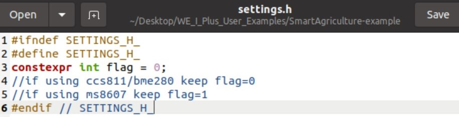
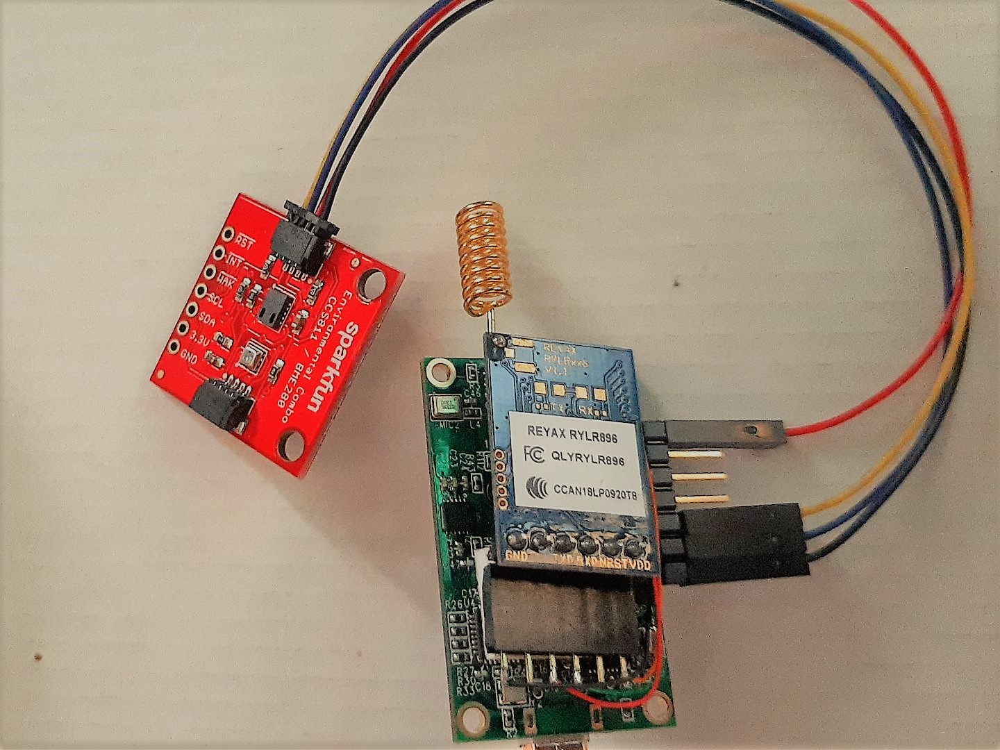
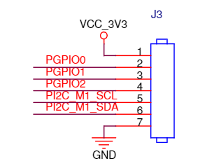
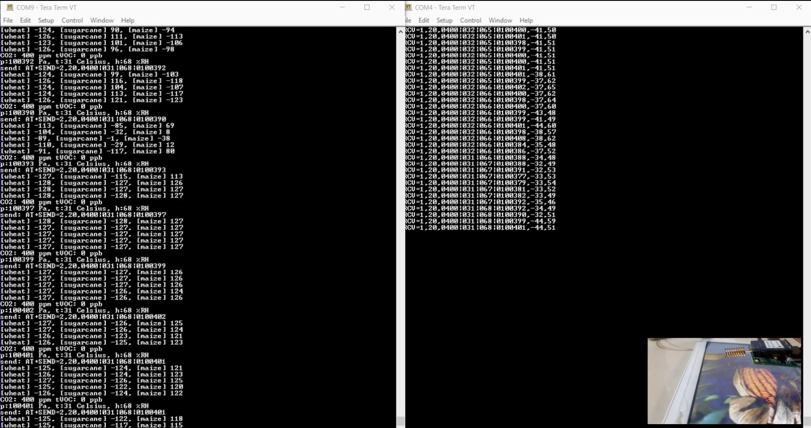
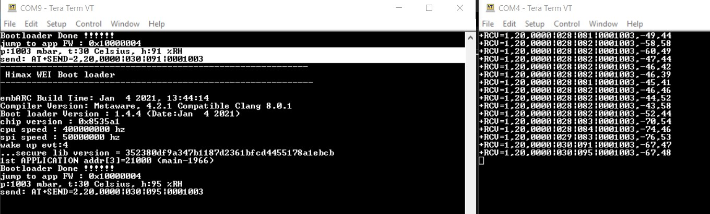

# Smart Agriculture Application using Himax WE-I Plus
The Smart Agriculture Application includes use of the Himax WE-I Plus Board with SparkFun's Qwiic sensors on farms or small scale home plantations to obtain PHT, CO2, VOC data and monitor proper growth of plants.

## Prerequisites
  - [Himax WE-I Plus EVB Endpoint AI Development Board](https://www.sparkfun.com/products/17256)
  - [LoRa - REYAX RYLR896](https://reyax.com/products/rylr896/) [[ AT COMMAND GUIDE ]](https://reyax.com/wp-content/uploads/2020/01/Lora-AT-Command-RYLR40x_RYLR89x_EN.pdf)
  - Either of the sensor boards 
    - [SparkFun Environmental Combo Breakout - CCS811/BME280 (Qwiic)](https://www.sparkfun.com/products/14348)
    - [SparkFun (SparkX) Qwiic Pressure/Humidity/Temp (PHT) Sensor - MS8607](https://www.sparkfun.com/products/16298)\
    The suitable board can be set from the `settings.h` file.
    

Also Make tool and toolkits are required. 
## Connections 

The J3 Connector\

- From LoRa to Himax WE-I Plus
  | LoRa        |                    |          |
  | :---------- | :----------------: | :------: |
  | Orange      |        3.3V        | J3 Pin 1 |
  | Black       |        GND         | J3 Pin 7 |
  | Green       | WEI TXD \ LoRa RXD | J3 Pin 2 |
  | Red         | WEI RXD \ LoRa TXD | J3 Pin 3 |
- From Sparkfun Sensor boards to Himax WE-I Plus
  | QWIIC       |       |          |
  | :---------- | :---: | :------: |
  | Red         | 3.3V  | J3 Pin 1 |
  | Black       |  GND  | J3 Pin 7 |
  | Yellow      |  SCL  | J3 Pin 5 |
  | Blue        |  SDA  | J3 Pin 6 |

## Build and flash image
- Build the Smart Agriculture Application and flash image. Flash image name will be `smart_agriculture_app.img`.
    ```
    make smart_agriculture_app
    make flash app=smart_agriculture_app
    ```
- After above steps, flash the .img file to your Himax WE-I Plus board using suitable Flash tool.
  
## Output
  - The environment data format
    - Co2 Value|Temperature|Humidity|Pressure\
      LoRa REYAX RYLR896\
      L.H.S - Sender (Himax WE-I Plus Board) ADDRESS=1, CRFOP=7\
      R.H.S - LoRa Receiver ADDRESS=2, CRFOP=7


https://user-images.githubusercontent.com/87312836/129950296-dec87ed6-90e3-4331-bfa4-027e49653982.mp4


  - With SparkFun Qwiic Environmental Combo Breakout Board - CCS811/BME280
    
  - With SparkFun (SparkX) Qwiic Pressure/Humidity/Temp (PHT) Sensor - MS8607
    
