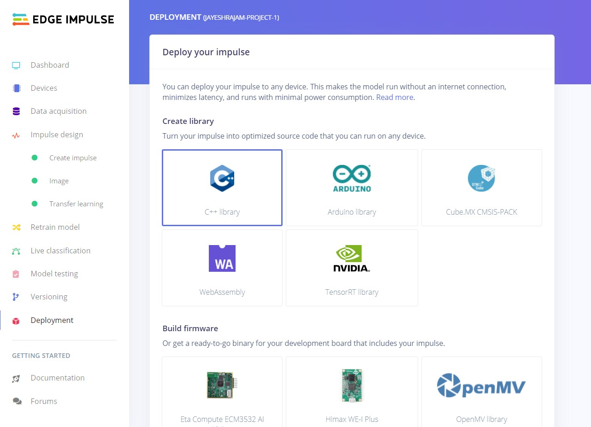
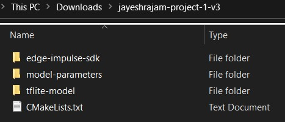
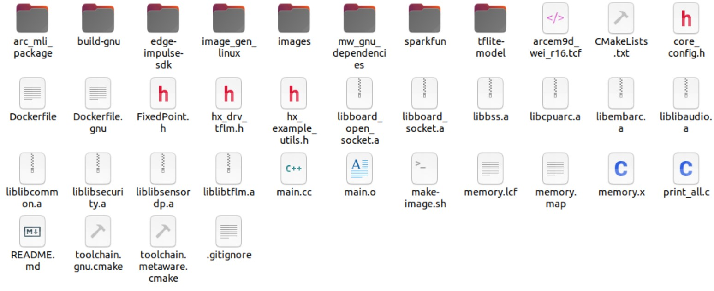
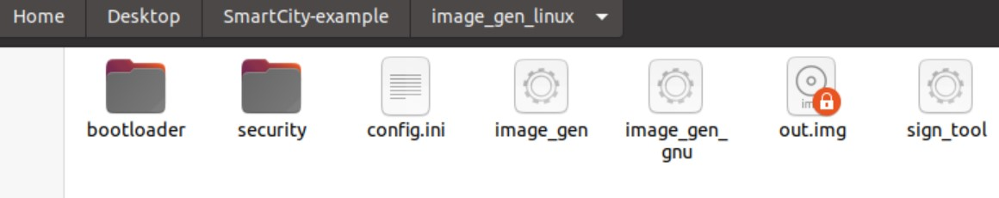
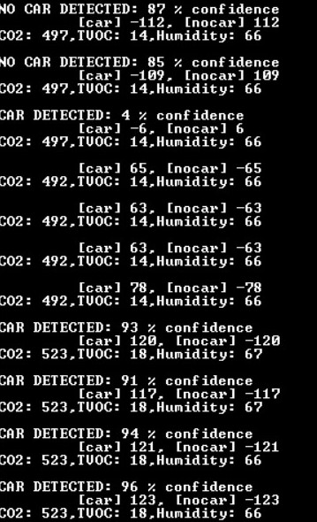

# Smart City Application using Himax WE-I Plus
Edge-Impulse based City Traffic Light application using Himax WE-I Plus Board, which detects whether a car has crossed the stop line or not, and also simultaneously uses SparkFun's Qwiic sensors to obtain CO2, TVOC and Humidity data.

## Prerequisites
- Hardware requirements
  - [SparkFun Environmental Combo Breakout - CCS811/BME280 (Qwiic)](https://www.sparkfun.com/products/14348)
  - [Himax WE-I Plus EVB Endpoint AI Development Board](https://www.sparkfun.com/products/17256)
- Software requirements
  - [Docker](https://docs.docker.com/engine/install/ubuntu/)
  - [Edge Impulse CLI](https://docs.edgeimpulse.com/docs/himax-we-i-plus)

## Connections from SparkFun Environmental Combo Board to Himax WE-I Plus

| QWIIC       |       |          |
| :---------- | :---: | :------: |
| Red line    | 3.3V  | J3 Pin 1 |
| Black line  |  GND  | J3 Pin 7 |
| Yellow line |  SCL  | J3 Pin 5 |
| Blue line   |  SDA  | J3 Pin 6 |

## Self Trained model
`Note`: To deploy `Already Compiled Application` skip to [Flash Image](https://github.com/JayeshRajam/WE_I_Plus_User_Examples/tree/main/SmartCity-example#flash-image) section of this file.

Please check [here](https://docs.edgeimpulse.com/docs) to build your own Edge Impulse project. The following shows the outline of the Impulse design in this project.
- Input Image data
  - Image width = 96
  - Image height = 96
- Output features
  - 2 (Car,Empty)

## Export C++ library to repository
- Head over to your Edge Impulse project, go to `Deployment` page, select `C++ library `.

  

- Select `Quantized (int8)` and click `Build` to download the `.zip` file of your project.

  

- Extract the `.zip` file.
	
	
- Copy the `edge-impulse-sdk` and `tflite-model` folders to this application folder. Then your folder structure `WE_I_Plus_User_Examples/SmartCity-example` should look like this:
  
	

    ```
    WE_I_Plus_User_Examples/SmartCity-example/
    |_arc_mli_package
    |_build-gnu
    |_edge-impulse-sdk
    |_image_gen_linux
    |_images
    |_mw_gnu_dependencies
    |_sparkfun
    |_tflite-model
    |_main.cc
    |_README.md
    |...
    ```

## Rebuilt/Compile the firmware
Now that you have customised your application and also if you've made any custom changes to `main.cc`, the firmware must be Rebuilt/Compile.

We used `Docker` here.
```
sudo docker build -t himax-build-gnu -f Dockerfile.gnu .
```
```
mkdir -p build-gnu
sudo docker run --rm -it -v $PWD:/app himax-build-gnu /bin/bash -c "cd build-gnu && cmake -DCMAKE_TOOLCHAIN_FILE=toolchain.gnu.cmake .."
```
```
sudo docker run --rm -it -v $PWD:/app:delegated himax-build-gnu /bin/bash -c "cd build-gnu && make -j && sh ../make-image.sh GNU"
```
If you face 'Permission denied' error, follow these steps: <br>
  Step1: Use `cd image_gen_linux` to change the directory. <br>
  Step2: Type `ls -l` command to see status of files.
  
  Note that `image_gen_gnu`, `image_gen` and `sign_tool` files need chmod +x permissions.  <br>
  Step3: If any of these files don't have the required permission assign them by 
  ```
  chmod u+x image_gen_gnu
  ```
  ```
  chmod u+x image_gen
  ```
  ```
  chmod u+x sign_tool
  ```
  Step4: Come back one directory by `cd ..` command and then run the previous Docker commands.
## Flash Image
Flash image name will be `out.img` and will be located in `image_gen_linux` of the directory.

Use Himax Flash Tool to flash this Image.

   ```
    himax-flash-tool --firmware-path image_gen_linux/out.img
  ```

## Output
Open a serial terminal with baudrate=115200 to show real time classification and environmental data.
In our application, we display whether a car is detected with confidence percentage along with environmental data on the console.


https://user-images.githubusercontent.com/87312836/127764205-f5e467e4-a03a-4f8d-95d1-d3085b11dfff.mp4


  

Also, LEDs are configured respectively.
|case|LED GREEN|LED RED|GPIO|
|----------|--|--|--|
|0|off|off|- |
|Car|on|off|HX_DRV_PGPIO_0 = 1 |
|NoCar|off|on|HX_DRV_PGPIO_1 = 1 |
